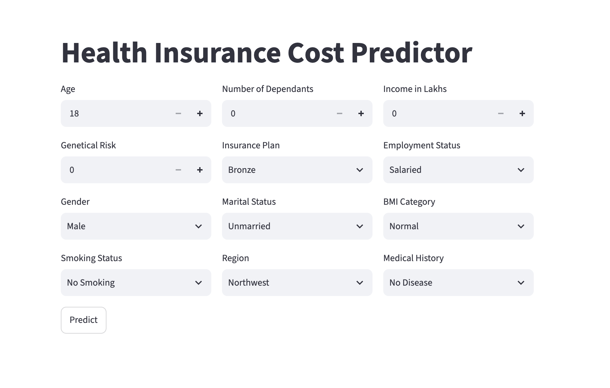
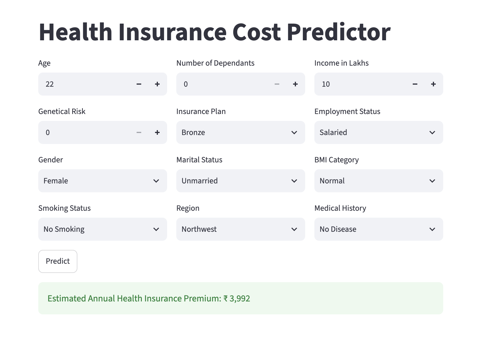
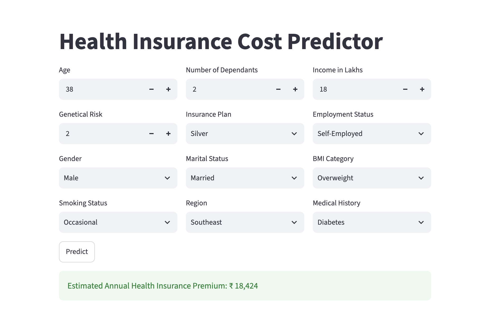
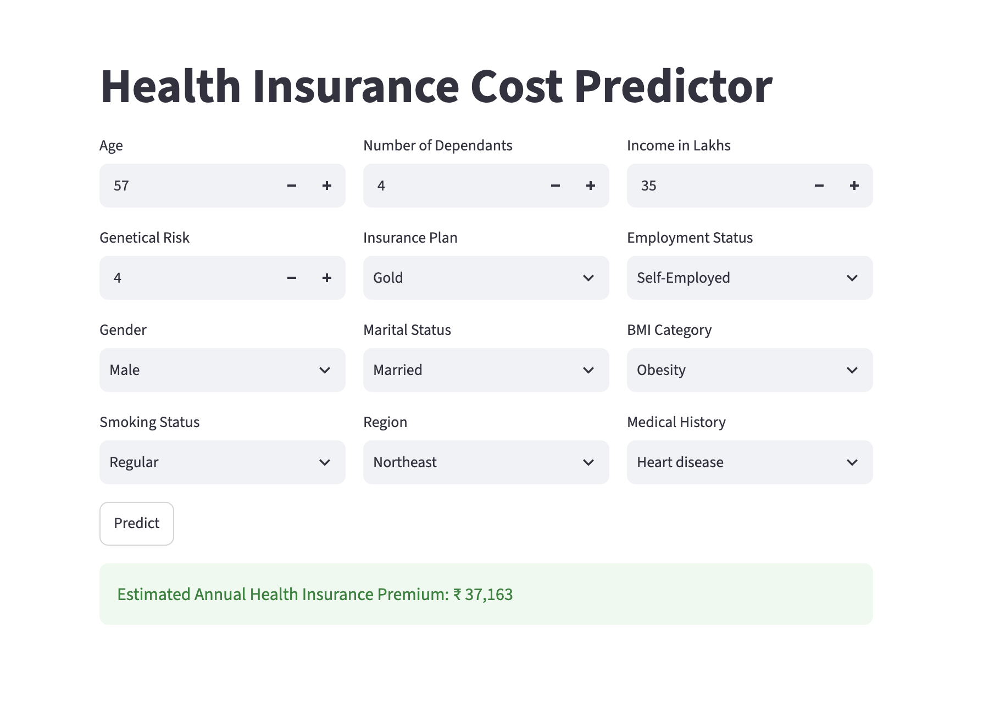

# 🏥 Healthcare Insurance Premium Estimator

[](https://www.python.org/)
[](https://healthcare-insurance-premium-estimator.streamlit.app/)
[](https://scikit-learn.org/)
[](LICENSE)

Estimate annual health insurance premiums using Machine Learning through an interactive Streamlit web application.

🌐 **Live Demo:** https://healthcare-insurance-premium-estimator.streamlit.app/

---

# 📖 Overview

Healthcare insurance premiums are influenced by various demographic, lifestyle, and medical factors. This project applies supervised machine learning to estimate an individual's annual insurance premium based on these characteristics.

The application provides a clean and interactive interface built with Streamlit, allowing users to input their information and receive an estimated annual premium instantly.

---

# ✨ Features

- Interactive Streamlit web application
- Real-time premium prediction
- User-friendly input interface
- Pre-trained Machine Learning models
- Automatic data preprocessing
- Clean project structure
- Deployed on Streamlit Cloud

---

# 🚀 Live Demo

### 🔗 https://healthcare-insurance-premium-estimator.streamlit.app/

---

# 📸 Screenshots

## Home Page



---

## Low Premium Prediction



---

## Medium Premium Prediction



---

## High Premium Prediction



---

# 🧠 Machine Learning Pipeline

```
Raw User Input
       │
       ▼
Feature Engineering
       │
       ▼
Categorical Encoding
       │
       ▼
Feature Scaling
       │
       ▼
Model Selection
       │
       ▼
Premium Prediction
       │
       ▼
Display Estimated Premium
```

---

# 📊 Input Features

The model considers the following attributes:

- Age
- Gender
- Region
- Marital Status
- Number of Dependents
- BMI Category
- Smoking Status
- Employment Status
- Annual Income
- Income Level
- Medical History
- Insurance Plan

---

# 🛠 Tech Stack

| Category | Technologies |
|-----------|--------------|
| Programming Language | Python |
| Machine Learning | Scikit-Learn |
| Data Processing | Pandas, NumPy |
| Model Serialization | Joblib |
| Gradient Boosting | XGBoost |
| Frontend | Streamlit |
| Deployment | Streamlit Cloud |
| Version Control | Git & GitHub |

---

# 📂 Project Structure

```
ml-project-healthcare-premium-prediction
│
├── app/
│   ├── main.py
│   └── prediction_helper.py
│
├── artifacts/
│   ├── model_rest.joblib
│   ├── model_young.joblib
│   ├── scaler_rest.joblib
│   └── scaler_young.joblib
│
├── notebooks/
│   └── healthcare_premium_prediction.ipynb
│
├── images/
│   ├── home.png
│   ├── low-premium.png
│   ├── medium-premium.png
│   └── high-premium.png
│
├── requirements.txt
└── README.md
```

---

# ⚙️ Installation

Clone the repository

```bash
git clone https://github.com/AnshKaushik-05/ml-project-healthcare-premium-prediction.git
```

Move into the project directory

```bash
cd ml-project-healthcare-premium-prediction
```

Create a virtual environment

```bash
python -m venv .venv
```

Activate the environment

### macOS / Linux

```bash
source .venv/bin/activate
```

### Windows

```bash
.venv\Scripts\activate
```

Install dependencies

```bash
pip install -r requirements.txt
```

Run the application

```bash
streamlit run app/main.py
```

---

# 📈 Example Prediction

| Feature | Value |
|----------|------|
| Age | 42 |
| BMI | Overweight |
| Smoking | No |
| Annual Income | ₹12 Lakhs |
| Medical History | Diabetes |
| Insurance Plan | Silver |

### Estimated Annual Premium

**₹33,294**

---

# 📌 Future Improvements

- Explain predictions using SHAP
- Compare multiple ML models
- Hyperparameter optimization
- Docker support
- CI/CD with GitHub Actions
- User authentication
- Prediction history
- Premium trend visualizations

---

# ⚠️ Disclaimer

This application is intended **for educational and demonstration purposes only**.

The predicted premium is generated by a Machine Learning model and should **not** be interpreted as an official quotation from any insurance provider.

---

# 🤝 Contributing

Contributions are welcome.

If you'd like to improve this project:

1. Fork the repository.
2. Create a feature branch.
3. Commit your changes.
4. Open a Pull Request.

---

# ⭐ Show Your Support

If you found this project helpful, consider giving it a **⭐ Star** on GitHub.

---

# 👨‍💻 Author

**Ansh Kaushik**

- GitHub: https://github.com/AnshKaushik-05
- LinkedIn: *(Add your LinkedIn profile here if you'd like.)*

---

## 📜 License

This project is licensed under the **MIT License**.